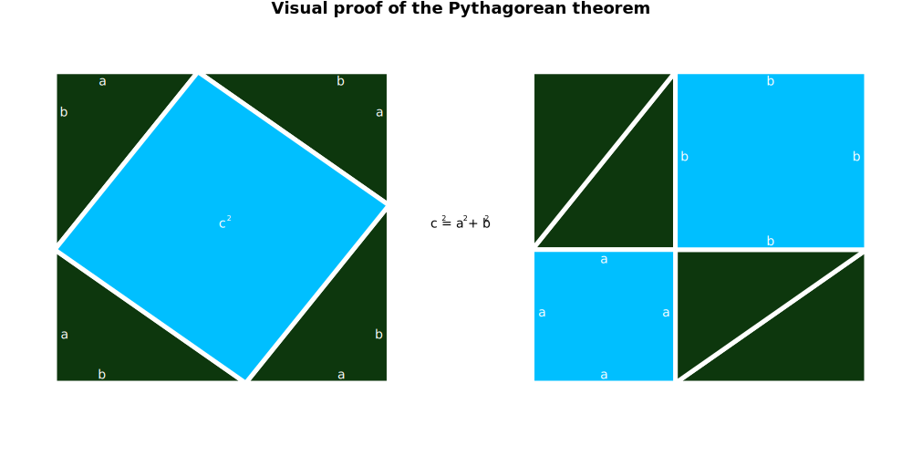

<!--html_preserve-->
<div style = "text-align:center;">
  
  <h1>d3lisp</h1>
</div>
<script src="webpage/highlight.pack.js"></script>
<script> hljs.initHighlightingOnLoad(); </script>
<style>pre.language-lisp {background-color: #fafafa;}</style>
<!--/html_preserve-->


```{r setup, include = FALSE}
knitr::opts_chunk$set(echo = TRUE)
knitr::opts_chunk$set(class.source = "language-r myclass")
knitr::opts_chunk$set(class.output = "language-r myclass")
knitr::opts_chunk$set(comment = NA)
knitr::opts_chunk$set(deletable = 1:18)

linkpage <- function (text, link){
  #Function that assigns internal link (link) to text
  #INPUT  
  #  > link: internal Hugo link
  #  > text: text to which link is assigned
  #OUTPUT: html snippet that references said link in text
  
  paste0('<a href=', link, '><span>',text, '</span></a>')
}
```

```{r, eval = TRUE, echo = FALSE}
knitr::knit_engines$set(clisp = function ( options ) {
  
  ##Searches for LISP in system
  cmd = Sys.which( 'clisp' )
  
  #If CLISP not found return error
  if ( options$eval ){
    
    #Check for a CLISP installation
    if (cmd == ""){ stop("ERROR: Cannot find CLISP installation")}  #This will quit knitr
    
    #Try running CLISP; else throw error
    clisp_res <- tryCatch({
       
       #Run CLISP from terminal
       clisp_res <- system2("clisp", input = options$code, stdout = T, stderr = T, env = options$engine.env)
       
       #Delete CLISP salutation and goodbye
       if (!any(is.na(options$deletable))){ clisp_res <- clisp_res[-c(options$deletable, length(clisp_res))]} 
       
     },
       error = function ( e ) {
         clisp_res <- paste('ERROR. The following error ocurred when executing CLISP code:\n', e)
       }
     )
    
  } else {
    clisp_res <- NULL
  }
 
  #Hide results if knitr option set to hide
  if ( options$results == 'hide' ) {clisp_res <- NULL}
   
  #Options for printing the results without #
  options$comment = NA
  options$class.output = "language-lisp myclass"
  options$class.source = "language-lisp myclass"
  
  #Output to knitr
  knitr::engine_output(options, options$code, clisp_res)

})
```

# Installation
<!-- html_preserve -->
<!--<a href = "index-es.html"><div class = "alert alert-info">
Click aquí para ir a versión en ESPAÑOL
</div></a>-->
<!-- /html_preserve -->

## Setup

**d3lisp** is a [d3js](https://d3js.org/) interface for creating plots in ANSI Common LISP. To run it you need to: 

1. Download the project (either `git clone https://github.com/RodrigoZepeda/d3lisp/` or click on `Download` button).
2. Load the `asdf` package. See [here](http://www.sbcl.org/asdf/Using-asdf-to-load-systems.html
) for loading packages on SBCL for example. 
```
(asdf:load-system :d3)
(use-package 'd3)
``` 

> Currently **d3lisp** has been tested in the following LISP versions:
> 1. SBCL
>

The function for creating the plots is `plot`. Here, for example, we plot the exponential function:
```
(let* ((x (list 0 0.5 1 1.5 2 2.5 3 3.5 4 4.5 5))
       (y (mapcar #'exp x)))
      (plot x y :title "Exponential"  :square-plot T  
                      :title-font-size 100 
                      :margin (list 10 10 10 10)
                      :padding (list 150 30 60 60) 
                      :x-label "x" :y-label "exp(x)" 
                      :interpolation "MonotoneX"
                      :file-name "MyFirstPlot"))
```


The plot is saved to a file called `MyFirstPlot.html` in your current directory. 

<!-- html_preserve -->
<div class = "alert alert-danger">
Currently **d3lisp** has been tested in the following LISP versions:
<ul>
<li> SBCL </li>
</ul>
</div>
<!-- /html_preserve -->

# Examples for getting started

## Simple example
plot
The basic function is `createplot` which uses as input two lists of same length representing each coordinate: `x` and `y`. Title and axis labels can be adjusted using the keywords `title`, `x-label` and `y-label` respectively. 

<!-- html_preserve -->
<div style = "text-align: center; background-color: transparent;" class = "well">

</div>
<!-- /html_preserve -->

```{clisp, eval = FALSE}
;Simplest example
(let ((x (list 10 15 30 50))
      (y (list 1 2 3 4)))
     (plot x y :title "Awesome plot"
               :x-label "Time since I started using LISP"
               :y-label "Number of extra parentheses in my life"))
```

## Scatter

To create a scatter plot you can set `line` to `NIL` for the plot not to do lines. The `scatter-color` allows for different color options. 

<!-- html_preserve -->
<div style = "text-align: center; background-color: transparent;" class = "well">

</div>
<!-- /html_preserve -->

```{clisp, eval = FALSE}
;Example of scatterplot
(let ((x (loop for i from 0 below 10 collect (random 101)))
      (y (loop for i from 0 below 10 collect (random 101))))
     (plot x y :title "Scatterplot" :x-label "x" :y-label "y" :line NIL
      :size 20 :scatter-color "purple"))
```

## Exponential

The `scatter-color` and `line-color` commands allow for color changes (can be inputed in text, HEX or rgb). The `title-font-size` allows for changing the size of plot title while `square-plot` forces the plot to be of square form (not rectangle of window size). The `padding` option controls the inner margin size and allows for the giant title to remain inside plot. We'll get back to [`interpolation`](#interpolation) in another example. 

<!-- html_preserve -->
<div style = "text-align: center; background-color: transparent;" class = "well">

</div>
<!-- /html_preserve -->

```{clisp, eval = FALSE}
;Exponential example using range
(let* ((x (range 0 5 :length-out 10))
       (y (mapcar #'exp x)))
      (plot x y :title "Exponential" :square-plot T :title-font-size 100
                :margin (list 10 10 10 10) :padding (list 150 30 60 60)
                :x-label "x" :y-label "exp(x)" :interpolation "MonotoneX"
                :scatter-color "red" :line-color "black"))
```

## Closed curves

You can create closed curves by inputing in order the vertices. In this example the package's command `ngon` generates the $x,y$ coordinates of a regular $n$-gon with radius (distance from center to vertex) $r = 3$ and $k = 5$ vertices (pentagon) centered at $(2,3)$. 

```{clisp, eval = FALSE}
(ngon 5 :r 3 :center (list 2 3))
```

Additional curves programmed in the code are available in [a following section](###curve_museum).

The `stroke-fill` keywords establishes the fill color of the figure. Axes can be deleted by setting `show-x-axis` and `show-y-axis` to `NIL`. 

<!-- html_preserve -->
<div style = "text-align: center; background-color: transparent;" class = "well">

</div>
<!-- /html_preserve -->

```{clisp, eval = FALSE}
;Regular ngon
(let ((x (first (ngon 5)))
      (y (second (ngon 5))))
      (plot x y :title "Pentagon" :square-plot T :stroke-fill "#47476b"
                      :line-color "black" :padding (list 75 75 60 60)
                      :title-font-size 50 :scatter NIL :square-plot T
                      :show-x-axis NIL :show-y-axis NIL :save T :svg-name "pentagon"))
```

## Multiple figures

You can add multiple figures in one plot. To do so, the `x` and `y` parameters must be lists of lists (it is LISP after all!) where each of the list components of `x` (resp. `y`) represents the `x` coordinates (resp. `y`) of a figure. Additional parameters such as `interpolation` or `interpolation` can be specified as usual (`:interpolation "CatmullRom"` sets `CatmullRom` interpolation for all curves) or as a list of choices `:line-color   (list "tomato" "steelblue")` sets the line color for the first figure as `tomato` and for the second one as `steelblue`. 

<!-- html_preserve -->
<div style = "text-align: center; background-color: transparent;" class = "well">

</div>
<!-- /html_preserve -->

```{clisp, eval = FALSE}
;Plot two variables at same time
(let* ((x (list (range 0 10) (range 0 10)))
       (y (list (mapcar #'sin (first x)) (mapcar #'cos (second x)))))
       (plot x y :title "My favorite trigonometric functions"
                 :x-label "x" :y-label "f(x)"
                 :scatter NIL
                 :interpolation "CatmullRom"
                 :line-color   (list "tomato" "steelblue")
                 :annotations (list (list "cos(x)" (/ (* 3 pi) 2) -1.1) (list "sin(x)" pi -1.1))
                 :annotations-color (list "tomato" "steelblue")
                 :annotations-font-size 15))
```

In the previous code we added annotations. Annotations work as lists of lists. Each annotation (that is, each final list) is composed of three parts:

```{clisp, eval = FALSE}
("Text of annotation" x-coordinate y-coordinate)
```

Thus `(list "sin(x)" pi -1.1)` writes `sin(x)` at point $(\pi, -1.1)$. The annotations options: `annotations-color` and `annotations-font-size` work the same as the `line-color` parameters. You can either choose a value to set for all (`:annotations-font-size 15` sets all annotations in size `15`) or specify one value for each annotation, `:annotations-color (list "tomato" "steelblue")` sets the first one in `tomato` color and the second in `steelblue`. 

# Plot options

## Interpolation
<!-- html_preserve -->
<div style = "text-align: center; background-color: transparent;" class = "well">

</div>
<!-- /html_preserve -->

There are several functions for interpolating the plotted points. All of these follow the **d3js** standard. Details for each curve can be found in the [D3 wiki](https://github.com/d3/d3-shape/blob/master/README.md#curves). 

```{clisp, eval = FALSE}
;Interpolation examples
(let* ((x (make-list 8 :initial-element (range 0 10 :length-out 5)))
       (y (make-list 8 :initial-element (mapcar #'sin (first x)))))
      (plot x y :title "Interpolation examples" :x-label "x" :y-label "sin"
          :interpolation (list "Linear" "Step" "StepBefore" "StepAfter"
                               "Basis" "Cardinal" "MonotoneX" "CatmullRom")
          :annotations  (list (list "Linear"      1 -1.1)
                              (list "Step"        2 -1.1)
                              (list "StepBefore"  3 -1.1)
                              (list "StepAfter"   4 -1.1)
                              (list "Basis"       5 -1.1)
                              (list "Cardinal"    6 -1.1)
                              (list "MonotoneX"   7 -1.1)
                              (list "CatmullRom"  8 -1.1))
          :annotations-color (list "red" "blue" "green" "orange" "steelblue" "purple" "pink" "Gray")
          :line-color (list "red" "blue" "green" "orange" "steelblue" "purple" "pink" "Gray")
          :line-opacity 0.5 :scatter-color "black" :scatter T))
```

## All options

<!-- html_preserve -->
<div style = "text-align: center; background-color: transparent;" class = "well">

</div>
<!-- /html_preserve -->

```{clisp, eval = FALSE}
;;This shows all the options available for the user
(let ((x (list 1 2 3 4 5))
      (y (list 1 -2 3 -4 5)))
  (plot x y
      :x-label "X axis label"
      :y-label "Y axis label"
      :title "Amazing plot title"
      :size 10                    ;;Size of points in scatter
      :x-minimum -1               ;;Minimum of x for plot
      :x-maximum 7                ;;Maximum of x for plot
      :y-minimum -4               ;;Minimum of y for plot
      :y-maximum 5                ;;Maximum of y for plot
      :scatter-color "orange"     ;;Color for points can be HEX or colorname
      :line-color    "#00bfff"    ;;Color for line can be HEX or colorname
      :line-width 5               ;;Width of line
      :stroke-fill "none"         ;;Choose a color for closed curves (fills between lines in curve)
      :line-opacity 1             ;;Alpha parameter between 0 and 1 for opacity of line
      :scatter-opacity 1          ;;Alpha parameter between 0 and 1 for opacity of scatter
      :line T                     ;;Plot line
      :scatter T                  ;;Plot scatter
      :interpolation "Linear"     ;;Interpolation mode. See other example for details
      :show-x-axis T              ;;Show X axis
      :show-y-axis NIL            ;;Hide Y axis
      :axis-x-label-color"white"  ;;Axis label colors
      :axis-y-label-color "white" ;;Axis label colors
      :axis-x-tick-color  "white" ;;Color of ticks on X axis
      :axis-y-tick-color  "yellow";;Color of ticks on Y axis
      :axis-x-color "#F5F5F5"     ;;Color of X axis
      :axis-y-color "#F5F5F5"     ;;Color of Y axis
      :x-axis-position 0          ;;Where to start X axis
      :y-axis-position 0          ;;Start axis at origin
      :plot-height "default"      ;;Size of plot height (set to 'default' or choose number)
      :plot-width 1000            ;;Size of plot width (set to 'default' or choose number)
      :outer-background-color "black"   ;;Color of outer margin
      :inner-background-color "#00455c" ;;Inner margin color
      :annotations (list "The way this starts is amazing" 1 1.4) ;;Annotate plot ('text' x y)
      :annotations-color "white"  ;;Choose annotation color
      :annotations-font-size 14   ;;Choose annotation size
      :title-font-size 20         ;;Choose title size
      :title-color "white"        ;;Color of title
      :margin (list 10 10 10 10)  ;;Margin for outer. Order: top, right, bottom, left
      :padding (list 60 30 60 30) ;;Margin for inner. Order: top, right, bottom, left
      :square-plot T              ;;Force plot to be of square form
      :save T                     ;;Save plot when generated
      :svg-name "advancedoptions" ;;SVG file name when downloading
      :file-name "MyHTML"))       ;;html file name when saving
```

# Advanced plots

In this section, several examples of plots are presented alongside their code. 

## Pythagorean theorem
<!-- html_preserve -->
<div style = "text-align: center; background-color: transparent;" class = "well">

</div>
<!-- /html_preserve -->

```{clisp, eval = FALSE}
;;Pythagorean theorem representation
(let* ((triangle1x (list 0 4 0 0))
       (triangle1y (list 0 0 3 0))

       (triangle2x (list 0 0 3 0))
       (triangle2y (list 3 7 7 3))

       (triangle3x (list 3 7 7 3))
       (triangle3y (list 7 7 4 7))

       (triangle4x (list 4 7 7 4))
       (triangle4y (list 0 0 4 0))

       (triangle5x (list 10 13 13 10))
       (triangle5y (list 3 3 7 3))

       (triangle6x (list 13 17 17 13))
       (triangle6y (list 0 0 3 0))

       (triangle7x (list 13 17 13 13))
       (triangle7y (list 0 3 3 0))

       (triangle8x (list 10 13 10 10))
       (triangle8y (list 3 7 7 3))

       (square0x (list 4 7 3 0 4))
       (square0y (list 0 4 7 3 0))

       (square1x (list 10 13 13 10 10))
       (square1y (list 0 0 3 3 0))

       (square2x (list 13 17 17 13 13))
       (square2y (list 3 3 7 7 3))

       (x (list triangle1x triangle2x triangle3x triangle4x triangle5x triangle6x
                triangle7x triangle8x square0x square1x square2x))
       (y (list triangle1y triangle2y triangle3y triangle4y triangle5y triangle6y
                triangle7y triangle8y square0y square1y square2y))

       (color (list "#0d370d" "#0d370d" "#0d370d" "#0d370d" "#0d370d" "#0d370d"
                    "#0d370d" "#0d370d" "#00bfff" "#00bfff" "#00bfff"))

       (annotations (list (list "2" 8.15 3.65)
                          (list "2" 8.6 3.65)
                          (list "2" 9.05 3.65)
                          (list "2" 3.65 3.65)
                          (list "c" 3.5 3.5)
                          (list "b" 1 0.1)
                          (list "a" 6 0.1)
                          (list "b" 6 6.7)
                          (list "a" 1 6.7)
                          (list "b" 0.2 6)
                          (list "a" 0.2 1)
                          (list "a" 6.8 6)
                          (list "b" 6.8 1)
                          (list "a" 10.2 1.5)
                          (list "a" 12.8 1.5)
                          (list "a" 11.5 0.1)
                          (list "a" 11.5 2.7)
                          (list "b" 15 3.1)
                          (list "b" 15 6.7)
                          (list "b" 13.2 5)
                          (list "b" 16.8 5)
                          (list "c = a + b" 8.5 3.5)))

         (annotationcolor (make-list (length annotations) :initial-element "white"))
         (annotationsize  (make-list (length annotations) :initial-element 14)))

         (setf (first annotationsize) 8)
         (setf (second annotationsize) 8)
         (setf (third annotationsize) 8)
         (setf (fourth annotationsize) 8)
         (setf (car (last annotationcolor)) "black")
         (setf (first annotationcolor) "black")
         (setf (second annotationcolor) "black")
         (setf (third annotationcolor) "black")

        (plot x y
            :stroke-fill color
            :title "Visual proof of the Pythagorean theorem"
            :scatter NIL
            :line-color "white"
            :line-width 5
            :show-x-axis NIL
            :show-y-axis NIL
            :annotations annotations
            :annotations-color annotationcolor
            :annotations-font-size  annotationsize
            :x-minimum 0 :x-maximum 17
            :y-minimum 0 :y-maximum 8
            :plot-height 500
            :plot-width 1000
            :square-plot NIL))
```

## Multiple regular polygons
<!-- html_preserve -->
<div style = "text-align: center; background-color: transparent;" class = "well">

</div>
<!-- /html_preserve -->

```{clisp, eval = FALSE}
;;Polygon museum
(let ((x1 (list 0))
      (y1 (list 0))
      (x2 (first   (ngon 3 :r 2)))
      (y2 (second  (ngon 3 :r 2)))
      (x3 (first   (ngon 4 :r 4)))
      (y3 (second  (ngon 4 :r 4)))
      (x4 (first   (ngon 5 :r 6)))
      (y4 (second  (ngon 5 :r 6)))
      (x5 (first   (ngon 6 :r 8)))
      (y5 (second  (ngon 6 :r 8)))
      (x6 (first   (ngon 7 :r 10)))
      (y6 (second  (ngon 7 :r 10)))
      (x7 (first   (ngon 8 :r 12)))
      (y7 (second  (ngon 8 :r 12)))
      (x8 (first   (ngon 9 :r 14)))
      (y8 (second  (ngon 9 :r 14)))
      (x9 (first   (ngon 10 :r 16)))
      (y9 (second  (ngon 10 :r 16)))
      (x10 (first  (ngon 11 :r 18)))
      (y10 (second (ngon 11 :r 18)))
      (x11 (first  (ngon 12 :r 20)))
      (y11 (second (ngon 12 :r 20))))

      ;Creation of all the poligons
      (plot (list x1 x2 x3 x4 x5 x6 x7 x8 x9 x10 x11)
                  (list y1 y2 y3 y4 y5 y6 y7 y8 y9 y10 y11)
                  :title "Regular poligons museum" :scatter T
                  :line-color (list "#ffa190" "#ff917e" "#ff826b" "#ff7259" "#ff6347"
                                   "#e5593f" "#cc4f38" "#b24531" "#993b2a" "#7f3123" "#66271c")
                  :size 4
                  :title-font-size 25
                  :title-color "white"
                  :line-width 4
                  :padding (list 50 30 60 50)
                  :x-minimum -20 :x-maximum 20 :y-minimum -20 :y-maximum 20
                  :scatter-color "white"
                  :outer-background-color "black"
                  :line-color "red"
                  :interpolation "Linear"
                  :show-x-axis NIL :show-y-axis NIL :square-plot T))

```

## 50 shades of gray
<!-- html_preserve -->
<div style = "text-align: center; background-color: transparent;" class = "well">

</div>
<!-- /html_preserve -->

```{clisp, eval = FALSE}
;;Creates a plot of 50 shades of gray
(let* ((n 50)
       (x (make-list n))
       (y (make-list n))
       (color (make-list n))
       (color-name (make-list n)))

      ;Loop through all RGB colors
      (let ((k -0.5) (my-step (/ 255 (1- n))) (current-step 0))
          (loop for i from 0 to (1- n)
              do (progn
                      (when (= (mod i 5) 0) (incf k))
                      (setf (nth i x) (list (+ 3 (- (mod i 5) 0.5)) (+ 3 (- (mod i 5) 0.5))
                                            (+ 3 (+ (mod i 5) 0.5)) (+ 3 (+ (mod i 5) 0.5))
                                            (+ 3 (- (mod i 5) 0.5))))
                      (setf (nth i y) (list (- k 0.5) (+ k 0.5) (+ k 0.5) (- k 0.5) (- k 0.5)))
                      (setf current-step (write-to-string (truncate (* i my-step))))
                      (setf (nth i color) (concatenate 'string
                          "rgb(" current-step "," current-step "," current-step ")"))
                      (setf (nth i color-name) (list (nth i color) (+ 3 (mod i 5)) k)))))

      (plot x y
              :title "50 Shades of Gray"
              :scatter NIL
              :line-color "none"
              :annotations-font-size 8
              :x-minimum -0.5 :x-maximum 10
              :y-minimum  0.0 :y-maximum 10.5
              :annotations color-name
              :annotations-color (reverse color)
              :show-x-axis NIL :show-y-axis NIL
              :square-plot T
              :padding (list 50 10 20 10)
              :margin  (list 40 10 10 10)
              :plot-height 1000
              :stroke-fill color))

```

## Scatter specifying color, size and transparency for each point
<!-- html_preserve -->
<div style = "text-align: center; background-color: transparent;" class = "well">

</div>
<!-- /html_preserve -->

```{clisp, eval = FALSE}
;;Simulates 500 points assigning each a different color
(let* ((n 500) ;;Number of points in simulation
       (x          (loop for i from 0 below n collect (list (random 1.0))))
       (y          (loop for i from 0 below n collect (list (random 1.0))))
       (point-size (loop for i from 0 below n collect (1+ (random 25))))
       (color      (loop for i from 0 below n collect
                      (concatenate 'string "rgb("
                         (write-to-string (random 255)) ","
                         (write-to-string (random 255)) ","
                         (write-to-string (random 255)) ")"))))
       (plot x y :line NIL
                 :title "Random points just floating around"
                 :x-label "Some variable"
                 :y-label "Some boring note"
                 :scatter-opacity 0.5 :scatter-color color :size point-size))

```

## Curve museum

The following curves are all implemented for plotting in the package. 

<!-- html_preserve -->
<div style = "text-align: center; background-color: transparent;" class = "well">

</div>
<!-- /html_preserve -->

```{clisp, eval = FALSE}
;Creation of curve museum
(let ((x1 (first  (hipocycloid 3 1  :center (list -15 10)
                                    :angle-points (range 0 (* 2 pi) :length-out 1000))))
      (y1 (second (hipocycloid 3 1  :center (list -15 10)
                                    :angle-points (range 0 (* 2 pi) :length-out 1000))))
      (a1 (list "Deltoid" -15 3))

      (x2 (first  (hipocycloid 3 (/ 3 4)  :center (list 0 10)
                                          :angle-points (range 0 (* 2 pi) :length-out 1000))))
      (y2 (second (hipocycloid 3 (/ 3 4)  :center (list 0 10)
                                          :angle-points (range 0 (* 2 pi) :length-out 1000))))
      (a2 (list "Astroid" 0 3))

      (x3 (first  (hipocycloid 4.1 1.1 :center (list 15 10)
                                       :angle-points (range 0 (* 50 pi) :length-out 1000))))
      (y3 (second (hipocycloid 4.1 1.1 :center (list 15 10)
                                       :angle-points (range 0 (* 50 pi) :length-out 1000))))
      (a3 (list "Hipocycloid" 15 3))

      (x4 (first  (epicycloid 1 1 :center (list -15 25)
                                  :angle-points (range 0 (* 50 pi) :length-out 1000))))
      (y4 (second (epicycloid 1 1 :center (list -15 25)
                                  :angle-points (range 0 (* 50 pi) :length-out 1000))))
      (a4 (list "Cardioid" -15 17))

      (x5 (first  (epicycloid 2 1 :center (list 0 25)
                                  :angle-points (range 0 (* 50 pi) :length-out 1000))))
      (y5 (second (epicycloid 2 1 :center (list 0 25)
                                  :angle-points (range 0 (* 50 pi) :length-out 1000))))
      (a5 (list "Nephroid" 0 17))

      (x6 (first  (epicycloid 2.1 1.1 :center (list 15 25)
                                      :angle-points (range 0 (* 50 pi) :length-out 1000))))
      (y6 (second (epicycloid 2.1 1.1 :center (list 15 25)
                                      :angle-points (range 0 (* 50 pi) :length-out 1000))))
      (a6 (list "Epicycloid" 15 17))

      (x7 (first  (involute 0.1 :center (list -15 40)
                                :angle-points (range 0 (* 10 pi) :length-out 1000))))
      (y7 (second (involute 0.1 :center (list -15 40)
                                :angle-points (range 0 (* 10 pi) :length-out 1000))))
      (a7 (list "Involute" -15 34))

      (x8 (first  (bicorn 4 :center (list 0 38))))
      (y8 (second (bicorn 4 :center (list 0 38))))
      (a8 (list "Bicorn" 0 34))

      (x9 (first  (archimedes 0.1 :center (list 15 40)
                                  :angle-points (range 0 (* 10 pi) :length-out 1000))))
      (y9 (second (archimedes 0.1 :center (list 15 40)
                                  :angle-points (range 0 (* 10 pi) :length-out 1000))))
      (a9 (list "Archimedes spiral" 15 34))

      (x10 (first  (epitrochoid 2.1 1.1  :d 1.5 :center (list -15 55)
                                         :angle-points (range 0 (* 50 pi) :length-out 1000))))
      (y10 (second (epitrochoid 2.1 1.1  :d 1.5 :center (list -15 55)
                                         :angle-points (range 0 (* 50 pi) :length-out 1000))))
      (a10 (list "Epitrochoid" -15 47))

      (x11 (first  (ngon 100 :r 3 :center (list 0 55))))
      (y11 (second (ngon 100 :r 3 :center (list 0 55))))
      (a11 (list "Circle" 0 47))

      (x12 (first  (hipotrochoid 3.1 1.1  :d 1.5 :center (list 15 55)
                                          :angle-points (range 0 (* 50 pi) :length-out 1000))))
      (y12 (second (hipotrochoid 3.1 1.1  :d 1.5 :center (list 15 55)
                                          :angle-points (range 0 (* 50 pi) :length-out 1000))))
      (a12 (list "Hipotrochoid" 15 47)))

      ;Creation of epicicloid
      (plot (list x1 x2 x3 x4 x5 x6 x7 x8 x9 x10 x11 x12)
            (list y1 y2 y3 y4 y5 y6 y7 y8 y9 y10 y11 y12)
            :title "Curve museum" :scatter NIL
            :title-font-size 25
            :line-width 1
            :annotations (list a1 a2 a3 a4 a5 a6 a7 a8 a9 a10 a11 a12)
            :padding (list 50 30 50 30)
            :x-minimum -30 :x-maximum 30 :y-minimum 5 :y-maximum 60
            :line-color "darkmagenta"
            :square-plot T :interpolation "CatmullRom"
            :show-x-axis NIL :show-y-axis NIL :square-plot T))

```
