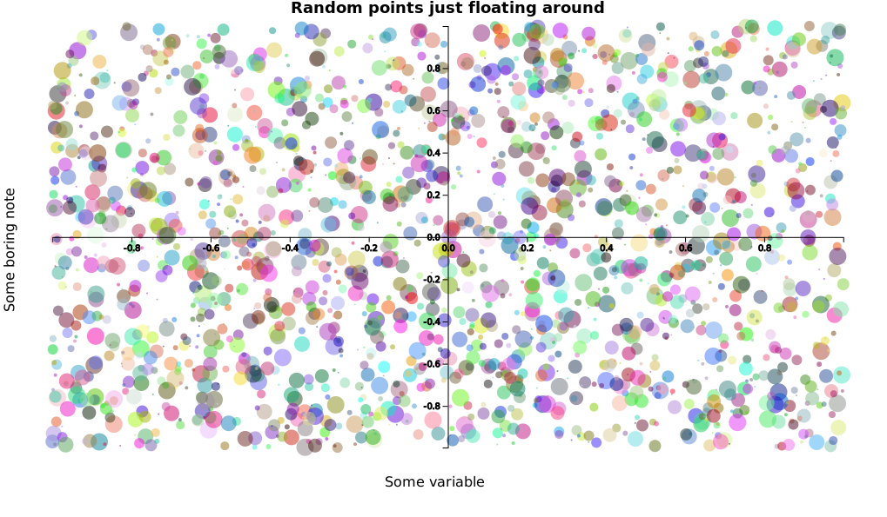

<!--html_preserve-->
<div style = "text-align:center;">
  
  <h1>D3LISP</h1>
</div>
<script src="webpage/highlight.pack.js"></script>
<script> hljs.initHighlightingOnLoad(); </script>
<style>pre.language-lisp {background-color: #fafafa;}</style>
<!--/html_preserve-->


```{r setup, include = FALSE}
knitr::opts_chunk$set(echo = TRUE)
knitr::opts_chunk$set(class.source = "language-r myclass")
knitr::opts_chunk$set(class.output = "language-r myclass")
knitr::opts_chunk$set(comment = NA)
knitr::opts_chunk$set(deletable = 1:18)

linkpage <- function (text, link){
  #Function that assigns internal link (link) to text
  #INPUT  
  #  > link: internal Hugo link
  #  > text: text to which link is assigned
  #OUTPUT: html snippet that references said link in text
  
  paste0('<a href=', link, '><span>',text, '</span></a>')
}
```

```{r, eval = TRUE, echo = FALSE}
knitr::knit_engines$set(clisp = function ( options ) {
  
  ##Searches for LISP in system
  cmd = Sys.which( 'clisp' )
  
  #If CLISP not found return error
  if ( options$eval ){
    
    #Check for a CLISP installation
    if (cmd == ""){ stop("ERROR: Cannot find CLISP installation")}  #This will quit knitr
    
    #Try running CLISP; else throw error
    clisp_res <- tryCatch({
       
       #Run CLISP from terminal
       clisp_res <- system2("clisp", input = options$code, stdout = T, stderr = T, env = options$engine.env)
       
       #Delete CLISP salutation and goodbye
       if (!any(is.na(options$deletable))){ clisp_res <- clisp_res[-c(options$deletable, length(clisp_res))]} 
       
     },
       error = function ( e ) {
         clisp_res <- paste('ERROR. The following error ocurred when executing CLISP code:\n', e)
       }
     )
    
  } else {
    clisp_res <- NULL
  }
 
  #Hide results if knitr option set to hide
  if ( options$results == 'hide' ) {clisp_res <- NULL}
   
  #Options for printing the results without #
  options$comment = NA
  options$class.output = "language-lisp myclass"
  options$class.source = "language-lisp myclass"
  
  #Output to knitr
  knitr::engine_output(options, options$code, clisp_res)

})
```

#Installation
<!-- html_preserve -->
<!--<a href = "index-es.html"><div class = "alert alert-info">
Click aquí para ir a versión en ESPAÑOL
</div></a>-->
<!-- /html_preserve -->


**d3lisp** is a [d3js](https://d3js.org/) interface for creating plots in Common LISP. To run it you need to: 

1. Install [quicklisp](https://www.quicklisp.org/beta/)
2. Use quicklisp to install [hunchentoot](https://edicl.github.io/hunchentoot/) (see here for [SBCL installation on Mac](https://medium.com/@m2k/web-server-on-mac-os-x-via-common-lisp-prism-6e94ef178c1c))
3. Have a browser and a persistent Internet connection

One you have installed and set up a directory with all the files, in SBCL:
```{clisp, eval = FALSE}
(setf *default-pathname-defaults* (truename "path/to/project"))
```

Load `setup.lisp` to set up the functions:
```{clisp, eval = FALSE}
(load "setup.lisp")
```

<!-- html_preserve -->
<div class = "alert alert-danger">
Currently **d3lisp** only runs fully on Mac with an SBCL implementation. You can use it on another platform by commenting (or deleting) line 54 of **createplot.lisp**:
<pre style = "background-color: transparent; border-color: white;"><code style = "background-color: transparent;">(uiop:run-program 
    (concatenate 'string "open http://localhost:" (write-to-string port) "/" pagename))</code></pre>
</div>
<!-- /html_preserve -->

#Examples for getting started

##Simple example

The basic function is `createplot` which uses as input two lists of same length representing each coordinate: `x` and `y`. Title and axis labels can be adjusted using the keywords `title`, `xlab` and `ylab` respectively. 

<!-- html_preserve -->
<div style = "text-align: center; background-color: transparent;" class = "well">

</div>
<!-- /html_preserve -->

```{clisp, eval = FALSE}
;Simplest example
(setq x (list 10 15 30 50))
(setq y (list 1 2 3 4))
(createplot x y :title "Awesome plot" 
                :xlab "Time since I started using LISP" 
                :ylab "Number of extra parentheses in my life")
```

##Scatter

To create a scatter plot you can set `line` to `NIL` for the plot not to do lines. The `scattercolor` allows for different color options. 

<!-- html_preserve -->
<div style = "text-align: center; background-color: transparent;" class = "well">

</div>
<!-- /html_preserve -->

```{clisp, eval = FALSE}
;Example of scatterplot
(setq x (mapcar (lambda (x) (random 100.0)) (make-list 500)))
(setq y (mapcar (lambda (x) (random 100.0)) (make-list 500)))
(createplot x y 
  :title "Scatterplot" 
  :xlab "x" 
  :ylab "y" 
  :line NIL 
  :size 5 
  :scattercolor "purple")
```

##Exponential

The `scattercolor` and `linecolor` commands allow for color changes (can be inputed in text, HEX or rgb). The `title-fontsize` allows for changing the size of plot title while `squareplot` forces the plot to be of square form (not rectangle of window size). The `padding` option controls the inner margin size and allows for the giant title to remain inside plot. We'll get back to [`interpolation`](#interpolation) in another example. 

<!-- html_preserve -->
<div style = "text-align: center; background-color: transparent;" class = "well">

</div>
<!-- /html_preserve -->

```{clisp, eval = FALSE}
;Exponential example using linspace
(setq x (list 0 0.5 1 1.5 2 2.5 3 3.5 4 4.5 5))
(setq y (mapcar #'exp x))
(createplot x y 
    :title "Exponential"  
    :title-fontsize 100 
    :squareplot T
    :padding (list 150 30 60 60) 
    :xlab "x" :ylab "exp(x)" 
    :interpolation "MonotoneX"
    :scattercolor "red" :linecolor "black"
)
```

##Closed curves

You can create closed curves by inputing in order the vertices. In this example the package's command `ngon` generates the $x,y$ coordinates of a regular $n$-gon with radius (distance from center to vertex) $r = 3$ and $k = 5$ vertices (pentagon) centered at $(2,3)$. 

```{clisp, eval = FALSE}
(ngon 5 :r 3 :center (list 2 3))
```

Additional curves programmed in the code are available in [a following section](###curve_museum).

The `strokefill` keywords establishes the fill color of the figure. Axes can be deleted by setting `showXaxis` and `showYaxis` to `NIL`. 

<!-- html_preserve -->
<div style = "text-align: center; background-color: transparent;" class = "well">

</div>
<!-- /html_preserve -->

```{clisp, eval = FALSE}
;Regular ngon
(setq x (first (ngon 5)))
(setq y (second (ngon 5)))
(createplot x y 
  :title "Pentagon" 
  :squareplot T 
  :strokefill "#47476b" 
  :linecolor "black"
  :padding (list 75 75 60 60)
  :title-fontsize 50
  :scatter NIL :squareplot T 
  :showXaxis NIL :showYaxis NIL 
  :save T :svgname "pentagon")
```

##Multiple figures

You can add multiple figures in one plot. To do so, the `x` and `y` parameters must be lists of lists (it is LISP after all!) where each of the list components of `x` (resp. `y`) represents the `x` coordinates (resp. `y`) of a figure. Additional parameters such as `interpolation` or `interpolation` can be specified as usual (`:interpolation "CatmullRom"` sets `CatmullRom` interpolation for all curves) or as a list of choices `:linecolor   (list "tomato" "steelblue")` sets the line color for the first figure as `tomato` and for the second one as `steelblue`. 

<!-- html_preserve -->
<div style = "text-align: center; background-color: transparent;" class = "well">

</div>
<!-- /html_preserve -->

```{clisp, eval = FALSE}
;Plot two variables at same time
(setq x (list (linspace 0 10) (linspace 0 10)))
(setq y (list (mapcar #'sin (first x)) (mapcar #'cos (second x))))
(createplot x y :title "My favourite trigonometric functions"  
                :xlab "x" :ylab "f(x)"
                :scatter NIL
                :interpolation "CatmullRom"
                :linecolor   (list "tomato" "steelblue") 
                :annotations (list 
                                (list "cos(x)" (/ (* 3 pi) 2) -1.1) 
                                (list "sin(x)" pi -1.1))
                :annotations-color (list "tomato" "steelblue") 
                :annotations-fontsize 15)
```

In the previous code we added annotations. Annotations work as lists of lists. Each annotation (that is, each final list) is composed of three parts:

```{clisp, eval = FALSE}
("Text of annotation" x-coordinate y-coordinate)
```

Thus `(list "sin(x)" pi -1.1)` writes `sin(x)` at point $(\pi, -1.1)$. The annotations options: `annotations-color` and `annotations-fontsize` work the same as the `linecolor` parameters. You can either choose a value to set for all (`:annotations-fontsize 15` sets all annotations in size `15`) or specify one value for each annotation, `:annotations-color (list "tomato" "steelblue")` sets the first one in `tomato` color and the second in `steelblue`. 

#Plot options

##Interpolation
<!-- html_preserve -->
<div style = "text-align: center; background-color: transparent;" class = "well">

</div>
<!-- /html_preserve -->

There are several functions for interpolating the plotted points. All of these follow the **d3js** standard. Details for each curve can be found in the [D3 wiki](https://github.com/d3/d3-shape/blob/master/README.md#curves). 

```{clisp, eval = FALSE}
;Interpolation examples
(setq x (make-list 8 :initial-element (linspace 0 10 :lengthout 5)))
(setq y (make-list 8 :initial-element (mapcar #'sin (first x))))
(createplot x y 
    :title "Interpolation examples" :xlab "x" :ylab "sin"
    :interpolation (list "Linear" "Step" "StepBefore" "StepAfter" 
                          "Basis" "Cardinal" "MonotoneX" "CatmullRom")
    :annotations  (list (list "Linear"      1 -1.1) 
                        (list "Step"        2 -1.1) 
                        (list "StepBefore"  3 -1.1) 
                        (list "StepAfter"   4 -1.1) 
                        (list "Basis"       5 -1.1) 
                        (list "Cardinal"    6 -1.1) 
                        (list "MonotoneX"   7 -1.1)
                        (list "CatmullRom"  8 -1.1))
    :annotations-color  (list "red" "blue" "green" "orange" 
                              "steelblue" "purple" "pink" "Gray")
    :linecolor (list "red" "blue" "green" "orange" 
                      "steelblue" "purple" "pink" "Gray")
    :lineopacity 0.5
    :scattercolor "black"
    :scatter T
)
```

##All options

<!-- html_preserve -->
<div style = "text-align: center; background-color: transparent;" class = "well">

</div>
<!-- /html_preserve -->

```{clisp, eval = FALSE}
;;This shows all the options available for the user
(setq x (list 1 2 3 4 5))
(setq y (list 1 -2 3 -4 5))
(createplot x y
    :xlab "X axis label" 
    :ylab "Y axis label" 
    :title "Amazing plot title" 
    :size 10                    ;;Size of points in scatter
    :xmin -1                    ;;Minimum of x for plot
    :xmax 7                     ;;Maximum of x for plot
    :ymin -4                    ;;Minimum of y for plot
    :ymax 5                     ;;Maximum of y for plot
    :scattercolor "orange"      ;;Color for points can be HEX or colorname
    :linecolor    "#00bfff"     ;;Color for line can be HEX or colorname 
    :linewidth 5                ;;Width of line 
    :strokefill "none"          ;;Choose a color for closed curves (fills between lines in curve) 
    :lineopacity 1              ;;Alpha parameter between 0 and 1 for opacity of line
    :scatteropacity 1           ;;Alpha parameter between 0 and 1 for opacity of scatter
    :line T                     ;;Plot line 
    :scatter T                  ;;Plot scatter 
    :interpolation "Linear"     ;;Interpolation mode. See other example for details
    :showXaxis T                ;;Show X axis 
    :showYaxis NIL              ;;Hide Y axis 
    :axisX_label_color "white"  ;;Axis label colors
    :axisY_label_color "white"  ;;Axis label colors
    :axisX_tick_color  "white"  ;;Color of ticks on X axis
    :axisY_tick_color  "yellow" ;;Color of ticks on Y axis
    :axisX_color "#F5F5F5"      ;;Color of X axis 
    :axisY_color "#F5F5F5"      ;;Color of Y axis  
    :xaxispos 0                 ;;Where to start X axis 
    :yaxispos 0                 ;;Start axis at origin
    :plotheight "default"       ;;Size of plot height (set to 'default' or choose number)
    :plotwidth 1000             ;;Size of plot width (set to 'default' or choose number)
    :outercolor "black"         ;;Color of outer margin
    :innercolor "#00455c"       ;;Inner margin color
    :annotations (list "The way this starts is amazing" 1 1.4) ;;Annotate plot ('text' x y)
    :annotations-color "white"  ;;Choose annotation color
    :annotations-fontsize 14    ;;Choose annotation size
    :title-fontsize 20          ;;Choose title size
    :title-color "white"        ;;Color of title
    :margin (list 10 10 10 10)  ;;Margin for outer. Order: top, right, bottom, left
    :padding (list 60 30 60 30) ;;Margin for inner. Order: top, right, bottom, left
    :squareplot T               ;;Force plot to be of square form 
    :save T                     ;;Save plot when generated 
    :svgname "advancedoptions"  ;;Filename 
)
```

#Advanced plots

In this section, several examples of plots are presented alongside their code. 

##Pythagorean theorem
<!-- html_preserve -->
<div style = "text-align: center; background-color: transparent;" class = "well">

</div>
<!-- /html_preserve -->

```{clisp, eval = FALSE}
;;Pythagorean theorem representation
(setf triangle1x (list 0 4 0 0))
(setf triangle1y (list 0 0 3 0))

(setf triangle2x (list 0 0 3 0))
(setf triangle2y (list 3 7 7 3))

(setf triangle3x (list 3 7 7 3))
(setf triangle3y (list 7 7 4 7))

(setf triangle4x (list 4 7 7 4))
(setf triangle4y (list 0 0 4 0))

(setf triangle5x (list 10 13 13 10))
(setf triangle5y (list 3 3 7 3))

(setf triangle6x (list 13 17 17 13))
(setf triangle6y (list 0 0 3 0))

(setf triangle7x (list 13 17 13 13))
(setf triangle7y (list 0 3 3 0))

(setf triangle8x (list 10 13 10 10))
(setf triangle8y (list 3 7 7 3))

(setf square0x (list 4 7 3 0 4))
(setf square0y (list 0 4 7 3 0))

(setf square1x (list 10 13 13 10 10))
(setf square1y (list 0 0 3 3 0))

(setf square2x (list 13 17 17 13 13))
(setf square2y (list 3 3 7 7 3))

(setf x (list triangle1x triangle2x triangle3x 
              triangle4x triangle5x triangle6x 
              triangle7x triangle8x square0x square1x square2x))
(setf y (list triangle1y triangle2y triangle3y
              triangle4y triangle5y triangle6y
              triangle7y triangle8y square0y square1y square2y))
(setf color (list "#0d370d" "#0d370d" "#0d370d" "#0d370d" 
                  "#0d370d" "#0d370d" "#0d370d" "#0d370d" 
                  "#00bfff	" "#00bfff" "#00bfff"))
(setf annotations 
  (list 
    (list "2" 8.15 3.65)
    (list "2" 8.6 3.65)
    (list "2" 9.05 3.65)
    (list "2" 3.65 3.65)
    (list "c" 3.5 3.5)
    (list "b" 1 0.1)
    (list "a" 6 0.1)
    (list "b" 6 6.7)
    (list "a" 1 6.7)
    (list "b" 0.2 6)
    (list "a" 0.2 1)
    (list "a" 6.8 6)
    (list "b" 6.8 1)
    (list "a" 10.2 1.5)
    (list "a" 12.8 1.5)
    (list "a" 11.5 0.1)
    (list "a" 11.5 2.7)
    (list "b" 15 3.1)
    (list "b" 15 6.7)
    (list "b" 13.2 5)
    (list "b" 16.8 5)
    (list "c = a + b" 8.5 3.5)
  )
)
(setf annotationcolor (make-list (length annotations) :initial-element "white"))
(setf annotationsize  (make-list (length annotations) :initial-element 14))
(setf (first annotationsize) 8)
(setf (second annotationsize) 8)
(setf (third annotationsize) 8)
(setf (fourth annotationsize) 8)
(setf (car (last annotationcolor)) "black")
(setf (first annotationcolor) "black")
(setf (second annotationcolor) "black")
(setf (third annotationcolor) "black")

(createplot x y 
    :strokefill color
    :title "Visual proof of the Pythagorean theorem"
    :scatter NIL
    :linecolor "white"
    :linewidth 5
    :showXaxis NIL
    :showYaxis NIL
    :annotations annotations
    :annotations-color annotationcolor
    :annotations-fontsize  annotationsize
    :xmin 0 :xmax 17
    :ymin 0 :ymax 8
    :plotheight 500
    :plotwidth 1000
    :squareplot NIL)
```

##Multiple regular polygons
<!-- html_preserve -->
<div style = "text-align: center; background-color: transparent;" class = "well">

</div>
<!-- /html_preserve -->

```{clisp, eval = FALSE}
;;Polygon museum
(setq x1 (list 0))
(setq y1 (list 0))

(setq x3 (first  (ngon 3 :r 2)))
(setq y3 (second (ngon 3 :r 2)))

(setq x4 (first  (ngon 4 :r 4)))
(setq y4 (second (ngon 4 :r 4)))

(setq x5 (first  (ngon 5 :r 6)))
(setq y5 (second (ngon 5 :r 6)))

(setq x6 (first  (ngon 6 :r 8)))
(setq y6 (second (ngon 6 :r 8)))

(setq x7 (first  (ngon 7 :r 10)))
(setq y7 (second (ngon 7 :r 10)))

(setq x8 (first  (ngon 8 :r 12)))
(setq y8 (second (ngon 8 :r 12)))

(setq x9 (first  (ngon 9 :r 14)))
(setq y9 (second (ngon 9 :r 14)))

(setq x10 (first  (ngon 10 :r 16)))
(setq y10 (second (ngon 10 :r 16)))

(setq x11 (first  (ngon 11 :r 18)))
(setq y11 (second (ngon 11 :r 18)))

(setq x12 (first  (ngon 12 :r 20)))
(setq y12 (second (ngon 12 :r 20)))


;Creation of epicicloid
(createplot (list x1 x3 x4 x5 x6 x7 x8 x9 x10 x11 x12) 
            (list y1 y3 y4 y5 y6 y7 y8 y9 y10 y11 y12) 
            :title "Regular poligons museum" :scatter T
            :linecolor (list  "#ffa190" "#ff917e" "#ff826b" 
                              "#ff7259" "#ff6347" "#e5593f" 
                              "#cc4f38" "#b24531" "#993b2a" 
                              "#7f3123" "#66271c")
            :size 4
            :title-fontsize 25
            :title-color "white"
            :linewidth 4
            :padding (list 50 30 60 50)
            :xmin -20 :xmax 20 :ymin -20 :ymax 20
            :scattercolor "white"
            :outercolor "black"
            :linecolor "red"
            :interpolation "Linear" 
            :showXaxis NIL :showYaxis NIL :squareplot T)
```

##50 shades of gray
<!-- html_preserve -->
<div style = "text-align: center; background-color: transparent;" class = "well">

</div>
<!-- /html_preserve -->

```{clisp, eval = FALSE}
;;Creates a plot of 50 shades of gray
(setf n 50) ;;Number of points of gray plot
(setf x       (make-list n))
(setf y       (make-list n))
(setf color   (make-list n))
(setf colname (make-list n))
(let ((k -0.5) (mystep (/ 255 (1- n))) (currentstep 0))
    (loop for i from 0 to (1- n)
        do (progn 
                (if (= (mod i 5) 0) (incf k))
                (setf (nth i x) 
                    (list (+ 3 (- (mod i 5) 0.5))
                          (+ 3 (- (mod i 5) 0.5)) 
                          (+ 3 (+ (mod i 5) 0.5)) 
                          (+ 3 (+ (mod i 5) 0.5)) 
                          (+ 3 (- (mod i 5) 0.5))))
                (setf (nth i y) 
                    (list (- k 0.5) (+ k 0.5) (+ k 0.5) (- k 0.5) (- k 0.5)))
                (setf currentstep (write-to-string (truncate (* i mystep))))
                (setf (nth i color) 
                    (concatenate 'string 
                        "rgb(" currentstep "," currentstep "," currentstep ")"))
                (setf (nth i colname) (list (nth i color) (+ 3 (mod i 5)) k))
            )
    )
)

(createplot x y  
        :title "50 Shades of Gray"
        :scatter NIL
        :linecolor "none"
        :annotations-fontsize 8
        :xmin -0.5 :xmax 10
        :ymin 0 :ymax 10.5
        :annotations colname
        :annotations-color (reverse color)
        :showXaxis NIL :showYaxis NIL
        :squareplot T
        :padding (list 50 10 20 10)
        :margin  (list 40 10 10 10)
        :plotheight 1000
        :strokefill color)
```

##Scatter specifying color, size and transparency for each point
<!-- html_preserve -->
<div style = "text-align: center; background-color: transparent;" class = "well">

</div>
<!-- /html_preserve -->

```{clisp, eval = FALSE}
;;Simulates 1000 points assigning each a different color
(setf n 2000) ;;Number of points in simulation
(setf x     (mapcar (lambda (x) (list (1- (random 2.0)))) (make-list n)))
(setf y     (mapcar (lambda (x) (list (1- (random 2.0)))) (make-list n)))
(setf color 
    (mapcar 
        (lambda (x) 
            (concatenate 'string "rgb(" 
                        (write-to-string (random 255)) "," 
                        (write-to-string (random 255)) "," 
                        (write-to-string (random 255)) ")"
            )
        ) 
        (make-list n)
    )
)
(setf sizes (mapcar (lambda (x) (1+ (random 10))) (make-list n)))
(createplot x y :line NIL 
        :title "Random points just floating around"
        :xlab "Some variable"
        :ylab "Some boring note"
        :scatteropacity 0.5 :scattercolor color :size sizes)
```

##Curve museum

The following curves are all implemented for plotting in the package. 

<!-- html_preserve -->
<div style = "text-align: center; background-color: transparent;" class = "well">

</div>
<!-- /html_preserve -->

```{clisp, eval = FALSE}
;Creation of curve museum

;Deltoid
(setq x1 (first  
          (hipocycloid 3 1  :center (list -15 10) 
                            :angle-points (linspace 0 (* 2 pi) :lengthout 1000))))
(setq y1 (second 
          (hipocycloid 3 1  :center (list -15 10) 
                            :angle-points (linspace 0 (* 2 pi) :lengthout 1000))))
(setf a1 (list "Deltoid" -15 3))

;Astroid
(setq x2 (first  
          (hipocycloid 3 (/ 3 4) :center (list 0 10) 
                                 :angle-points (linspace 0 (* 2 pi) :lengthout 1000))))
(setq y2 (second 
          (hipocycloid 3 (/ 3 4) :center (list 0 10) 
                                 :angle-points (linspace 0 (* 2 pi) :lengthout 1000))))
(setf a2 (list "Astroid" 0 3))

;General Hipocycloid
(setq x3 (first  
          (hipocycloid 4.1 1.1 :center (list 15 10) 
                               :angle-points (linspace 0 (* 50 pi) :lengthout 1000))))
(setq y3 (second 
          (hipocycloid 4.1 1.1 :center (list 15 10) 
                               :angle-points (linspace 0 (* 50 pi) :lengthout 1000))))
(setf a3 (list "Hipocycloid" 15 3))

;Cardioid
(setq x4 (first  (epicycloid 1 1 :center (list -15 25) 
                                 :angle-points (linspace 0 (* 50 pi) :lengthout 1000))))
(setq y4 (second (epicycloid 1 1 :center (list -15 25) 
                                 :angle-points (linspace 0 (* 50 pi) :lengthout 1000))))
(setf a4 (list "Cardioid" -15 17))

;Nephroid
(setq x5 (first  (epicycloid 2 1 :center (list 0 25) 
                                 :angle-points (linspace 0 (* 50 pi) :lengthout 1000))))
(setq y5 (second (epicycloid 2 1 :center (list 0 25) 
                                 :angle-points (linspace 0 (* 50 pi) :lengthout 1000))))
(setf a5 (list "Nephroid" 0 17))

;Epicycloid
(setq x6 (first  (epicycloid 2.1 1.1 :center (list 15 25) 
                                     :angle-points (linspace 0 (* 50 pi) :lengthout 1000))))
(setq y6 (second (epicycloid 2.1 1.1 :center (list 15 25) 
                                     :angle-points (linspace 0 (* 50 pi) :lengthout 1000))))
(setf a6 (list "Epicycloid" 15 17))

;Involute of circle
(setq x7 (first  (involute 0.1 :center (list -15 40) 
                               :angle-points (linspace 0 (* 10 pi) :lengthout 1000))))
(setq y7 (second (involute 0.1 :center (list -15 40) 
                               :angle-points (linspace 0 (* 10 pi) :lengthout 1000))))
(setf a7 (list "Involute" -15 34))

;Bicorn
(setq x8 (first  (bicorn 4 :center (list 0 38))))
(setq y8 (second (bicorn 4 :center (list 0 38))))
(setf a8 (list "Bicorn" 0 34))

;Archimedes spiral
(setq x9 (first  
          (archimedes 0.1 :center (list 15 40) 
                          :angle-points (linspace 0 (* 10 pi) :lengthout 1000))))
(setq y9 (second 
          (archimedes 0.1 :center (list 15 40) 
                          :angle-points (linspace 0 (* 10 pi) :lengthout 1000))))
(setf a9 (list "Archimedes spiral" 15 34))

;General Epitrochoid
(setq x10 (first  
           (epitrochoid 2.1 1.1  :d 1.5 :center (list -15 55) 
                :angle-points (linspace 0 (* 50 pi) :lengthout 1000))))
(setq y10 (second 
           (epitrochoid 2.1 1.1  :d 1.5 :center (list -15 55) 
                :angle-points (linspace 0 (* 50 pi) :lengthout 1000))))
(setf a10 (list "Epitrochoid" -15 47))

;Circle
(setq x11 (first  (ngon 100 :r 3 :center (list 0 55))))
(setq y11 (second (ngon 100 :r 3 :center (list 0 55))))
(setf a11 (list "Circle" 0 47))

;General Hipotrochoid
(setq x12 (first  
           (hipotrochoid 3.1 1.1  :d 1.5 :center (list 15 55) 
                  :angle-points (linspace 0 (* 50 pi) :lengthout 1000))))
(setq y12 (second 
           (hipotrochoid 3.1 1.1  :d 1.5 :center (list 15 55) 
                  :angle-points (linspace 0 (* 50 pi) :lengthout 1000))))
(setf a12 (list "Hipotrochoid" 15 47))

;Plot of the curve museum
(createplot (list x1 x2 x3 x4 x5 x6 x7 x8 x9 x10 x11 x12) 
            (list y1 y2 y3 y4 y5 y6 y7 y8 y9 y10 y11 y12) 
            :title "Curve museum" :scatter NIL
            :title-fontsize 25
            :linewidth 1
            :annotations (list a1 a2 a3 a4 a5 a6 a7 a8 a9 a10 a11 a12)
            :padding (list 50 30 50 30)
            :xmin -30 :xmax 30 :ymin 5 :ymax 60
            :linecolor "darkmagenta"
            :squareplot T :interpolation "CatmullRom" 
            :showXaxis NIL :showYaxis NIL :squareplot T)
```
